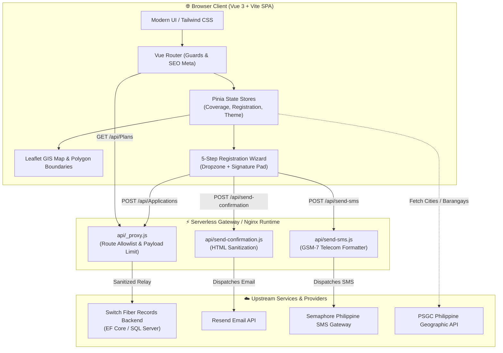

# ⚡ Switch Fiber — Subscriber Portal & Web Application

<div align="center">

[](https://github.com/switchfiber/switchfiberusers/actions/workflows/ci.yml)
[](https://nodejs.org/)
[](https://vuejs.org/)
[](https://vitejs.dev/)
[](https://tailwindcss.com/)
[](LICENSE)
[](#-production-deployment--containerization)

<p align="center">
  <strong>Fast, Reliable, and Pure Fiber Internet Connection in Rizal, Philippines.</strong><br>
  Official modern Single Page Application (SPA), GIS coverage exploration portal, and automated digital subscriber onboarding engine.
</p>

[✨ Highlights](#-features--highlights) •
[🏛️ Architecture](#%EF%B8%8F-system-architecture) •
[🛠️ Tech Stack](#%EF%B8%8F-technology-stack) •
[🚀 Quick Start](#-quick-start--local-development) •
[⌨️ NPM Scripts](#%EF%B8%8F-cli-commands--npm-scripts) •
[📦 Deployment](#-production-deployment--containerization) •
[🛡️ Security](#%EF%B8%8F-security--access-control) •
[📄 License](#-license--credits)

</div>

---

## ✨ Features & Highlights

- 🗺️ **Interactive GIS Coverage Engine**:
  - Full Leaflet & OpenStreetMap interactive mapping of active fiber distribution network and NAP (Network Access Point) terminals.
  - GeoJSON polygon boundaries across **Binangonan, Angono, Taytay, Teresa, Cardona, Morong, Baras, Tanay, and Antipolo**.
  - Dynamic municipality center focusing and instant barangay fiber feasibility checks.

- 📝 **5-Step Digital Subscriber Onboarding**:
  - **Plan Selection**: Interactive comparison of symmetrical plans (Plan 699, Plan 999, Plan 1499, Plan 1999).
  - **Location Pinning**: Precise GPS location pin picker with reverse geocoding and nearest landmark input.
  - **Document Attachment**: Drag-and-drop ID file upload powered by Dropzone with automated **EXIF GPS extraction**.
  - **Digital Contract & Signature Capture**: HTML5 Canvas signature pad for legally binding subscriber agreements (RA 10173 compliant).
  - **Reference Code Generation**: Instant deterministic reference code issuance for real-time tracking.

- 📡 **Real-Time Application Status Tracker**:
  - Searchable by reference number to view line survey scheduling, engineering feasibility audit, and technician dispatch progression.

- ⚡ **Secure Serverless Edge Proxies**:
  - `api/Plans.js` & `api/Applications.js`: Strict route allowlisting, origin sanitization, and upstream API relay.
  - `api/send-confirmation.js`: Automated applicant confirmation email dispatch via Resend API.
  - `api/send-sms.js`: SMS confirmation dispatch via Semaphore Philippine telecom SMS gateway.

- 🎨 **Modern Design & Dark Mode System**:
  - High-performance UI built with Tailwind CSS, Lucide icons, and zero layout shift theme toggle (Dark / Light mode).

---

## 🏛️ System Architecture



---

## 🛠️ Technology Stack

| Layer | Technologies | Purpose |
| :--- | :--- | :--- |
| **Frontend Framework** | [Vue.js 3](https://vuejs.org/) (Composition API, `<script setup>`) | High-performance reactive UI layer |
| **Build Tool & Bundler** | [Vite 6](https://vitejs.dev/) | Instant HMR development and optimized production chunking |
| **State Management** | [Pinia 3](https://pinia.vuejs.org/) | Type-safe, modular state management |
| **Client Routing** | [Vue Router 4](https://router.vuejs.org/) | SPA routing, scroll restoration, dynamic metadata |
| **Styling & Icons** | [Tailwind CSS 3](https://tailwindcss.com/), [Lucide Vue Next](https://lucide.dev/) | Utility-first CSS and modern vector icons |
| **Mapping & GIS** | [Leaflet 1.9](https://leafletjs.com/), OpenStreetMap | Spatial network and barangay polygon visualization |
| **Media & EXIF** | [Dropzone 6](https://www.dropzone.dev/), [exifr](https://github.com/MikeKovarik/exifr) | Document upload and EXIF GPS metadata extraction |
| **Serverless Functions** | Node.js (Vercel Serverless / Edge runtime) | Secure backend proxy and notification dispatchers |
| **Testing & Gates** | Node.js Native Test Runner (`node:test`, `node:assert/strict`) | Zero-dependency, ultra-fast automated test suite |
| **Containerization** | Docker, Nginx 1.27 Alpine | Multi-stage production container runtime |

---

## 🚀 Quick Start & Local Development

### Prerequisites
- **Node.js**: >= 18.0.0 (LTS 20 or 22 recommended)
- **npm**: >= 9.0.0

### Installation & Run

1. **Clone the repository**:
   ```bash
   git clone https://github.com/switchfiber/switchfiberusers.git
   cd switchfiberusers
   ```

2. **Install dependencies**:
   ```bash
   npm ci
   ```

3. **Configure Environment Variables**:
   ```bash
   cp .env.example .env
   ```
   Edit `.env` with your configuration:
   ```env
   BACKEND_API_URL=https://103.249.198.43:8090
   RESEND_API_KEY=re_your_api_key_here
   RESEND_FROM_EMAIL="Switch Fiber <noreply@harmonyitc.com>"
   SITE_URL=http://localhost:3000
   SEMAPHORE_API_KEY=your_semaphore_api_key
   SEMAPHORE_SENDER_NAME=SWITCHFIBER
   ```

4. **Start Development Server**:
   ```bash
   npm run dev
   ```
   Open `http://localhost:3000` in your browser.

---

## ⌨️ CLI Commands & NPM Scripts

| Command | Action | Description |
| :--- | :--- | :--- |
| `npm run dev` | Development Server | Starts Vite dev server with notification middleware on port 3000 |
| `npm test` | Automated Tests | Runs full test suite using Node.js native test runner |
| `npm run test:watch` | Test Watch Mode | Re-runs tests automatically upon file modification |
| `npm run lint` | Static Code Analysis | Validates ECMAScript syntax and JSON configurations across the repo |
| `npm run build` | Production Build | Compiles optimized production bundle into `dist/` |
| `npm run preview` | Local Preview | Serves production build locally for pre-release inspection |

---

## 📦 Production Deployment & Containerization

### A. Containerized Deployment (Docker + Nginx)

The repository includes an enterprise-hardened multi-stage `Dockerfile` and `nginx.conf`:

```bash
# Build production Docker image
docker build -t switchfiber-portal:latest .

# Run container on port 80
docker run -d \
  -p 80:80 \
  --name switchfiber-app \
  --restart unless-stopped \
  switchfiber-portal:latest

# Check container health status
docker ps --filter "name=switchfiber-app"
```

### B. Vercel Deployment (Serverless Edge)

Configured out of the box via `vercel.json`:
1. Connect the repository to **Vercel**.
2. Set environment variables (`BACKEND_API_URL`, `RESEND_API_KEY`, `SITE_URL`, `SEMAPHORE_API_KEY`).
3. Deploy — client routes and serverless functions in `api/` are automatically routed.

### C. Netlify / Cloudflare Pages (Static SPA)
- **Build Command**: `npm run build`
- **Publish Directory**: `dist`
- **SPA Fallback**: Handled via `dist/index.html` rewrites.

---

## 🛡️ Security & Access Control

- **Serverless API Proxy**: The browser client communicates exclusively with same-origin serverless endpoints. Upstream endpoints and certificates remain protected behind the proxy.
- **Strict Route & Method Allowlisting**: Only `/api/Plans` (`GET`) and `/api/Applications` (`POST`) are permitted.
- **Payload Guard**: Requests exceeding 256 KB are rejected before upstream processing.
- **HTML Sanitization**: All applicant input fields are escaped before inclusion in email and SMS dispatches.
- **Defensive Response Headers**: Configured with `X-Frame-Options: SAMEORIGIN`, `X-Content-Type-Options: nosniff`, `Referrer-Policy: strict-origin-when-cross-origin`, and `Permissions-Policy`.
- **Data Privacy Act (RA 10173)**: Applicant information and valid IDs are handled under strict confidentiality.

For vulnerability disclosures, see [SECURITY.md](SECURITY.md).

---

## 📄 License & Credits

- **License**: Released under the [MIT License](LICENSE).
- **Organization**: Switch Fiber Philippines (Harmony ITC).
- **Customer Care Hotline**: `0915 407 7565` | **Email**: `customercare@switchfiber.ph`
